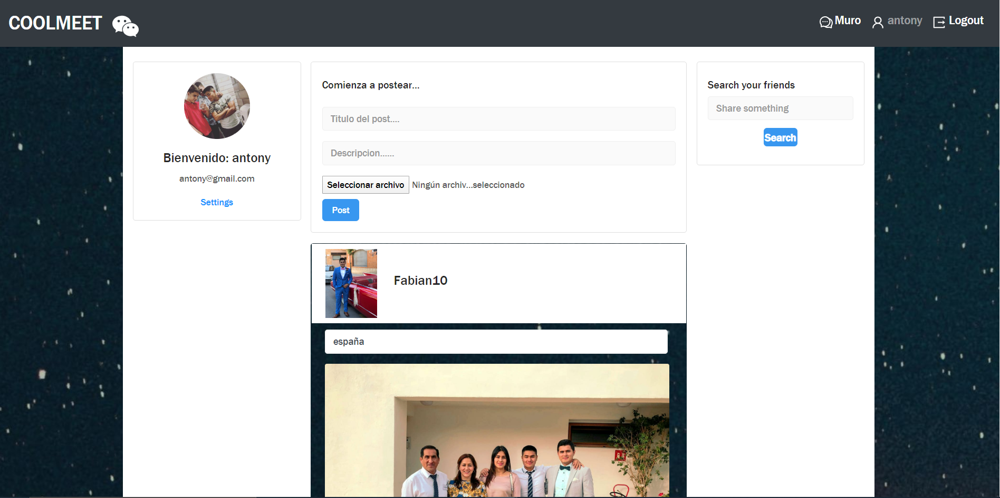

# PROYECTO-RED-SOCIAL
## COOLMEET


### Este es mi Red-social , acontinuación hare unas breves explicaciones de como funciona, los resquisitos, las tecnologias que hemos utilizamo y demas, espero que os guste, graciass._

## Pre-requisitos 📋

_¿Que cosas necesitas para instalar el software y como instalarlas?_

Necesitaremos una herramienta donde podremos trabajar , en el cual yo he utilizado Visual Studio Code, en el back he utilizado php-laravel(esta en otro repositorio con sus explicaciones etc), tambien tenemos que tener instalado xampp para la base de datos,  El proyecto es compatible para todas los sistemas operativos, y para todas las plataformas de internet.

## Instalación 🔧


_Empezamos con la instalación_

_El primer paso al descargar el repositorio, tenemos que hacer el comando de abajo para poder descargar todos los modulos que hemos utilizado y asi poder hacer funcionar el proyecto, importante entrar en la carpeta de fronted y realizar el comando

  

```
npm i
```

  

_Y para arrancar el fronted, lo haremos con el siguiente comando, lo mismo que antes situarnos en cada carpeta y ejecutar el siguiente comando_

```
npm start
```
_Y ahora os voy mostrar algunos aspectos de la pagina_

  

## Register

 _Esta es la pagina del registro en el cual ponemos nuestro username, nuestro correo y nuestra contraseña_
## Login

_Despues de habernos registrado con exito nos redigera al login donde debemos poner nuestro correo y contraseña con la que nos hemos registrado_
## MURO

_Una vez nos hemos logueado bien no redigera a nuestro muro donde veremos nuestro foto perfil,( al ingresar tiene una foto de perfil por defecto, pero yo ya me puse una foto),tambien podremos hacer post y ver los post de las demas personas registradas_
### POST

_En esta foto podemos ver el post, sale nuestra foto que hemos subido a la red social, nuestro titulo de nuestro post y una descripcion y los likes_
### PERFIL

_Este es nuestro perfil, donde podemos ver nuestra foto de perfil y tambien la podemos cambiar, podemos ver tambien que los post que hemos subido se nos colocara automaticamente abajo en nuestras fotos._

## Construido con 🛠️

_En este proyecto hemos utilizado las siguientes tecnologias :_

  

*  REACT  
*  REDUX
*  LARAVEL
*  MYSQL


  

## Autores ✒️

  


*  **Antony** - *Todo el proyecto* -(https://github.com/antony0110)


---

⌨️ con ❤️ por [Antony](https://github.com/antony0110)
